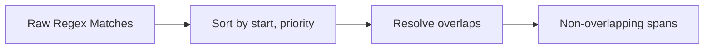

# Baseline Redaction Module

This folder implements the **baseline regex-based redaction system**. It provides simple, reproducible detection of Protected Health Information (PHI) from free-text reports.

## Overview

The baseline system identifies PHI using regular expressions (regex) targeting common identifiers such as names, dates, MRNs, phone numbers, emails, and addresses. Each detection produces a **span**, the core unit of annotation and redaction.

### What is a Span?
A span is a dictionary describing a PHI match:

```json
{
  "start": 16,
  "end": 26,
  "label": "MRN",
  "confidence": 0.92,
  "rule": "MRN_TOKEN"
}
```

- **start / end**: Character offsets in the source text
- **label**: PHI category (e.g., PERSON, DATE, PHONE)
- **confidence**: Rule-specific prior probability (static in the baseline)
- **rule**: The regex rule that produced this match

### Span Resolution Algorithm
Multiple rules can overlap (e.g., an email containing a person’s name). The resolution algorithm ensures deterministic, non-overlapping output:

1. **Collect** spans from all regex rules.
2. **Sort** by start offset, then by descending priority (specific rules > generic rules).
3. **Resolve overlaps**:
   - Keep higher-priority span if overlapping.
   - Merge spans if same label and priority.
   - Trim or discard spans fully covered by higher-priority matches.
4. **Return** an ordered, non-overlapping list of spans.

### Visual Example
Input:
```
Contact Dr. Jane Smith at jane.smith@example.com or 843-555-0199.
```

Raw spans (before resolution):
```
[PERSON]  start=8  end=18  "Jane Smith"
[EMAIL]   start=22 end=45  "jane.smith@example.com"
[PERSON]  start=22 end=32  "jane.smith"
[PHONE]   start=49 end=61  "843-555-0199"
```

Resolved spans:
```
[PERSON]  start=8  end=18  "Jane Smith"
[EMAIL]   start=22 end=45  "jane.smith@example.com"
[PHONE]   start=49 end=61  "843-555-0199"
```

Mermaid diagram:


### Redaction Policy
By default, the baseline applies a **token replacement policy**:
- Replace each span with a `[[LABEL]]` token.
- Example: `"Dr. Jane Smith, MRN A12-9Z"` → `"[[PERSON]], MRN [[MRN]]"`

Future policies (masking, dropping) can be added.

## File Structure
```
baseline/
├── __init__.py        # Package entry
├── rules.py           # Regex rules with labels, priorities, confidences
├── detect.py          # Span detection + resolution
├── redact.py          # Redaction policies
├── synth_gen.py       # Synthetic data generator
├── evaluate.py        # Evaluation harness (precision/recall/F1)
└── tests/             # Unit tests
```

## How to Run

### Run detection + redaction
```bash
python -m baseline.detect --in data/sample.jsonl --out baseline/preds.jsonl
python -m baseline.redact --in data/sample.jsonl --pred baseline/preds.jsonl --out baseline/out.jsonl
```

### Quick inline smoke test
```bash
python - <<'PY'
from baseline.detect import find_spans
from baseline.redact import apply

text = "Dr. Jane Smith, MRN A12-9Z, seen 1/2/2024. Call 843-555-0199."
spans = find_spans(text)
print("Spans:", spans)
print("Redacted:", apply(text, spans))
PY
```

### Run synthetic data generation
```bash
python -m baseline.synth_gen --n 50 --out data/synth.jsonl
```

### Evaluate baseline
```bash
python -m baseline.evaluate --data data/synth.jsonl --out out/report.json
```

## Notes
- All regexes are intentionally conservative; recall is prioritized over precision in the baseline.
- Synthetic data is used to avoid exposure to real PHI.
- Evaluation currently self-scores baseline; once gold labels are added, true performance metrics will be meaningful.

---
This baseline provides the **control system** against which ML-based approaches will be measured in Phase 1.

